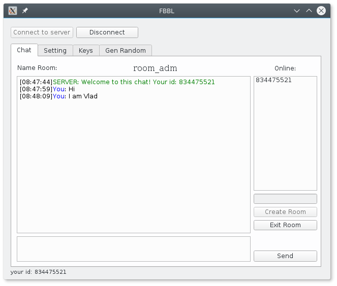

# rsachat
RSA Chat Python (client/server) Чат на стадии доработки

Форма написана на PyQT

Чат:
1. При подключении к серверу клиенты попадают в общую комнату без шифрования.
2. Далее можно создавать комнаты и у каждой комнаты есть свой ключ шифрования.

Комнаты:
1. Чтобы зайти в комнату нужно нажать дважды на имя комнаты. Далее админу комнаты придёт запрос на пропуск. Админ увидит ID клиентов, которые хотят войти в его комнату во вкладке Setting.
2. В любой комнате должен быть админ! Если из комнаты все выходят, то комната удаляется.
3. Если из комнаты выходит админ, то права переходят по иерархии "кто раньше пришёл".

