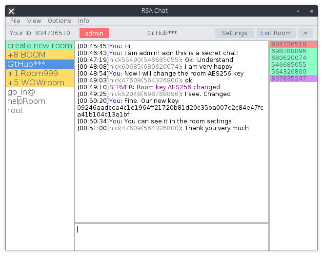

# rsachat
RSA Chat Python (client/server) Чат на стадии доработки

Форма написана на PyQT5

Чат:
1. При подключении к серверу клиенты попадают в общую комнату без шифрования.
2. Далее можно создавать комнаты и у каждой комнаты есть свой ключ шифрования.

Графический генератор случайных чисел:
1. Относительно нарисованных линий вашей мышкой, генерируется случайное число. С помощью этого числа будет сгенерирован ключ AES-256. Для генерации RSA ключа: функция случайных чисел по нарисованным точкам передаётся в функцию генерации RSA ключей.

